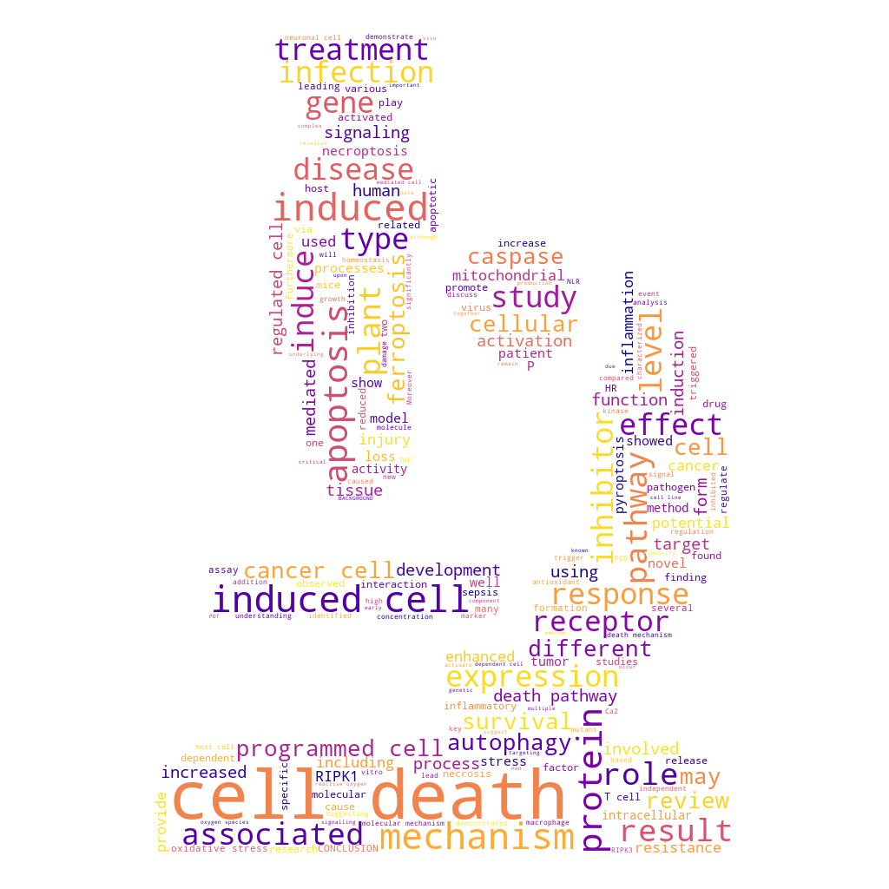

# Create wordcloud from Pubmed abstracts
A neat script to generate an customizable [wordcloud](https://en.wikipedia.org/wiki/Tag_cloud) by scraping abstracts on Pubmed using a user-defined query.

The idea is to use smart [advanced Pubmed queries](https://pubmed.ncbi.nlm.nih.gov/advanced/) to obtain a wordcloud showing the most frequent words appearing in abstracts.

## Example
See wordcloud_settings.json for the settings used to generate the output below.
### Final output

### Mask


## Used libraries
- [Biopython](https://biopython.org/): for accessing Pubmed and fetching publications
- [PIL](https://pillow.readthedocs.io/en/stable/): for reading mask file and saving final output
- [Wordcloud by Andreas Mueller](https://amueller.github.io/word_cloud/): for the generation of the actual wordcloud

## Author
Marco Dalla Vecchia

## Installation
### Python users
1. Install [conda](https://conda.io/projects/conda/en/latest/user-guide/install/index.html)
2. Create conda environment

```
$ conda env create -f requirements.yml
```
3. Activate environment
```
$ conda activate biopython-wordcloud-env
```
4. Run the script and follow the instructions

**In case you want to make use of them, make sure to have the mask and the json file in the same folder as the python script**
```
$ python wordcloud_from_input.py
```

### Windows
I was planning to make a single file executable file for Windows but I don't know how to handle the dependencies yet.

## Usage
The script is designed to ask the user the most important information and settings for the creation of the wordcloud.

### Settings
The script will ask for the following:
- Is there a json config file already? If yes, it will generate a wordcloud purely based on those configurations. If not, proceed.    
- Email address &rarr; checked if it's valid format
- Query &rarr; this is an [pubmed advanced query](https://pubmed.ncbi.nlm.nih.gov/advanced/), use the online tool to find the desired query then copy/paste it here
- Background color &rarr; this is the color used for the background of the generated wordcloud. Defaults to _transparent_.
- Colormap &rarr; this is a [matplotlib valid colormap](https://matplotlib.org/stable/gallery/color/colormap_reference.html) used to color the text of the wordcloud. Check the webpage and type in the name. Defaults to _viridis_.
- Maximum number of fetched publications &rarr; this is the max number of papers fetched from Pubmed to create the wordcloud. Defaults to _300_.
- Name of mask file &rarr; this is the name of the black and white mask image which can optionally be used to give the wordcloud a custom shape. Defaults to _no mask_.

### Output
- papers.txt &rarr; this will contain DOI info, title, authors and abstract of found papers from Pubmed. Only the abstract texts will be used for the creation of the wordcloud.
- wordcloud_settings.json &rarr; json file containing the settings used in the creation of the last wordcloud. It can be reused.
- wordcloud.png &rarr; final output (png format to allow for transparency)

## Contributions
This script can easily be adapted to other circumstances or the wordcloud settings can be further controlled by changing the code directly. Feel free to suggest possible improvements!